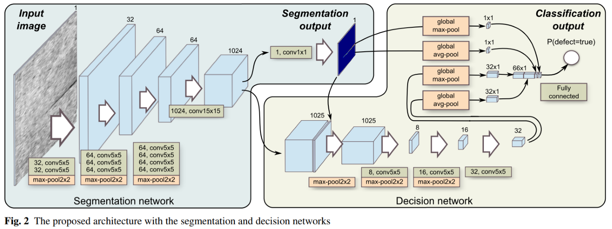
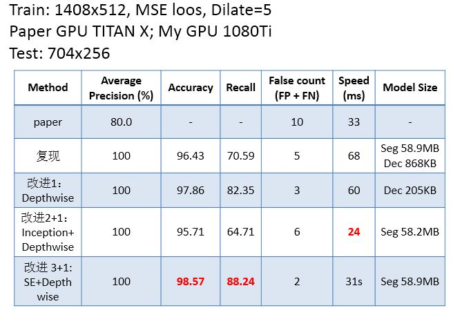

# Surface-Defect-Detection
PyTorch implementation of "Segmentation-Based Deep-Learning Approach for Surface-Defect Detection" .

### Done

* add Depthwise+Pointwise 
* add Inception
* add SE

Get started quickly [run_demo.ipynb](https://github.com/mengcius/Surface-Defect-Detection/blob/master/run_demo.ipynb)

### Paper Model

### Performance

Trained model：

[segment_net_100.pth](https://mengcius.coding.net/s/0d5a3e8f-2305-47c6-a85f-5954e005dfaa)

[decision_net_100.pth](https://github.com/mengcius/Surface-Defect-Detection/blob/master/saved_models/decision_net_100.pth)

DATASET：

[KolektorSDD_Data](https://mengcius.coding.net/api/share/download/2e3e085d-d26c-4c63-b57d-a3f066443d89)

Fork https://github.com/seanXYZ/SegDecNet

